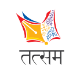

# Tatsam-NSUT Website


[](https://opensource.org/licenses/Tatsam)



[](https://www.instagram.com/tatsam.nsut/)


___Welcome to the __official__ repository of the __Tatsam-NSUT__ website!___ <br> This website is designed to be the central hub for all things related to Tatsam - The Hindi Society of NSUT.

## Overview

Tatsam-NSUT is a society dedicated to promoting the richness of the Hindi language, culture, and arts. Our website aims to bring you the latest updates, events, competitions, and insights into the world of Tatsam.

## Tech Used

This project is built with the following technologies:

- [React.js](https://reactjs.org/)
- [Tailwind CSS](https://tailwindcss.com/)

## Table of Contents

- [Getting Started](#getting-started)
- [Features](#features)
- [Contributing](#contributing)
- [License](#license)

## Getting Started

To run the Tatsam-NSUT website locally and start contributing, follow these steps:

### Prerequisites

- [Node.js](https://nodejs.org/) installed
- [NPM](https://www.npmjs.com/) (Node Package Manager) installed

### Installation

1. Clone this repository:
   ```bash
   git clone https://github.com/yourusername/tatsam-nsut-website.git
   
2. Navigate to the project folder:
   ```bash
   cd tatsam-nsut-website
   
3. Install dependencies:
   ```bash
   npm install

The website will be accessible at http://localhost:3000.
   
## Features

- [Event listings and updates]
- [Events registrations]
- [Contact form for inquiries and feedback]
- [Newsletter subscription]
- [Team members section and socials]

## Contributors

Thanks to the following contributors for their work on this project:

- [MrNikhillyadav](https://github.com/MrNikhillyadav)
- [Excalibur02](https://github.com/Excalibur02)
- [DAKSHTECHIE1](https://github.com/DAKSHTECHIE1)
- [ajitkushwaha123](https://github.com/ajitkushwaha123)


 ## Contributing
 
  We welcome contributions from the community. If you'd like to get involved, please follow our contribution guidelines.

## License

This project is the property of Tatsam - The Hindi Society of NSUT. All rights are reserved, and no specific license is granted to others for its use. It is intended solely for the purposes of the Tatsam society.


